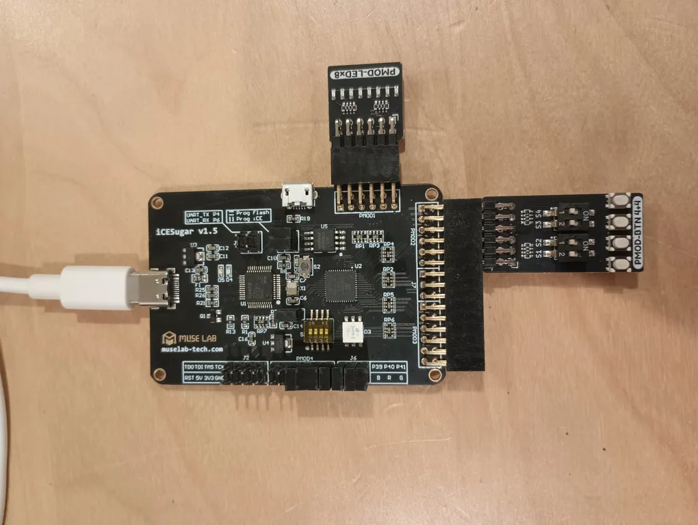

# Baugh Wooley async signed multiplier
A SystemVerilog parametrized high-speed multiplier module.
Verification includes a simple testbench, a UVM testbench, and formal verification.

This project was based on 
[verilog_template](https://github.com/sifferman/verilog_template/).

## Usage
To simulate the `multiply` testbench, run:
`make sim SIM_MK=multiply`.
Replace `SIM_MK` with the testbench to run.

To run gate level simulation
`make gls SIM_MK=multiply`

To run the formal verification:
`make formal`

Only for ice40-up5k sg48: to generate the bitstream, run:
`make bitstream`

Only for icesugar: to program the board:
`make program`

For timing:
`make build/synth/ice40.rpt`

For each new test bench added, a `<module name>.mk` file needs to be added in this format:
```
SIM_TOP = multiply_tb
SIM_TB = tb/multiply/multiply_tb.sv
SIM_SRC = rtl/multiply.sv \
					rtl/baugh_wooley.sv \
					rtl/half_add.sv \
					rtl/full_add.sv
```

- `SIM_TOP` is the moudle name of the test bench.
- `SIM_TB` is the testbench file.
- `SIM_SRC` are the sources needed for that testbench.

For the top module, an `fpga.mk` needs to be made in this format:
```
RTL_TOP = top 
RTL_SRC =	synth/icesugar/top.sv \
					rtl/multiply.sv \
					rtl/baugh_wooley.sv \
					rtl/half_add.sv \
					rtl/full_add.sv
```

- `RTL_TOP` is the top module for the fpga.
- `RTL_SRC` are the sources needed for synthesis of the top module.

## UVM
To run the UVM test, cd to `tb/multiply_uvm` and follow the instructions there.

## Setup
This project used the 
[icesugar](https://github.com/wuxx/icesugar)
fpga board with the 
[sipeed basic pmod kit](https://wiki.sipeed.com/hardware/en/tang/tang-PMOD/FPGA_PMOD.html),
connected as pictured:



## Async multiplication
Comparing only signed multiplication:

Using `assign p_o = a_i * b_i`
```
Device utilisation:
   ICESTORM_LC:      37/   5280     0%
  ICESTORM_RAM:       0/     30     0%
         SB_IO:      16/     96    16%
         SB_GB:       0/      8     0%
  ICESTORM_PLL:       0/      1     0%
   SB_WARMBOOT:       0/      1     0%
  ICESTORM_DSP:       0/      8     0%
ICESTORM_HFOSC:       0/      1     0%
ICESTORM_LFOSC:       0/      1     0%
        SB_I2C:       0/      2     0%
        SB_SPI:       0/      2     0%
        IO_I3C:       0/      2     0%
   SB_LEDDA_IP:       0/      1     0%
   SB_RGBA_DRV:       0/      1     0%
ICESTORM_SPRAM:       0/      4     0%
```

Using `baugh_wooley #(.p_width(4)) bw_inst ()`
```
Device utilisation:
   ICESTORM_LC:      29/   5280     0%
  ICESTORM_RAM:       0/     30     0%
         SB_IO:      16/     96    16%
         SB_GB:       0/      8     0%
  ICESTORM_PLL:       0/      1     0%
   SB_WARMBOOT:       0/      1     0%
  ICESTORM_DSP:       0/      8     0%
ICESTORM_HFOSC:       0/      1     0%
ICESTORM_LFOSC:       0/      1     0%
        SB_I2C:       0/      2     0%
        SB_SPI:       0/      2     0%
        IO_I3C:       0/      2     0%
   SB_LEDDA_IP:       0/      1     0%
   SB_RGBA_DRV:       0/      1     0%
ICESTORM_SPRAM:       0/      4     0%
```

My design uses 8 less LUTs than yosys' multiply when doing a 4x4 multiplication.

# Acknowledgements
This project was based on 
[verilog_template](https://github.com/sifferman/verilog_template/).

```
Copyright (c) 2025 Ethan Sifferman

Redistribution and use in source and binary forms, with or without modification, are permitted provided that the following conditions are met:

1. Redistributions of source code must retain the above copyright notice, this list of conditions and the following disclaimer.

2. Redistributions in binary form must reproduce the above copyright notice, this list of conditions and the following disclaimer in the documentation and/or other materials provided with the distribution.

3. Neither the name of the copyright holder nor the names of its contributors may be used to endorse or promote products derived from this software without specific prior written permission.

THIS SOFTWARE IS PROVIDED BY THE COPYRIGHT HOLDERS AND CONTRIBUTORS “AS IS” AND ANY EXPRESS OR IMPLIED WARRANTIES, INCLUDING, BUT NOT LIMITED TO, THE IMPLIED WARRANTIES OF MERCHANTABILITY AND FITNESS FOR A PARTICULAR PURPOSE ARE DISCLAIMED. IN NO EVENT SHALL THE COPYRIGHT HOLDER OR CONTRIBUTORS BE LIABLE FOR ANY DIRECT, INDIRECT, INCIDENTAL, SPECIAL, EXEMPLARY, OR CONSEQUENTIAL DAMAGES (INCLUDING, BUT NOT LIMITED TO, PROCUREMENT OF SUBSTITUTE GOODS OR SERVICES; LOSS OF USE, DATA, OR PROFITS; OR BUSINESS INTERRUPTION) HOWEVER CAUSED AND ON ANY THEORY OF LIABILITY, WHETHER IN CONTRACT, STRICT LIABILITY, OR TORT (INCLUDING NEGLIGENCE OR OTHERWISE) ARISING IN ANY WAY OUT OF THE USE OF THIS SOFTWARE, EVEN IF ADVISED OF THE POSSIBILITY OF SUCH DAMAGE.
```

The uvm portion was based on
[verilator-verification](https://github.com/antmicro/verilator-verification).
